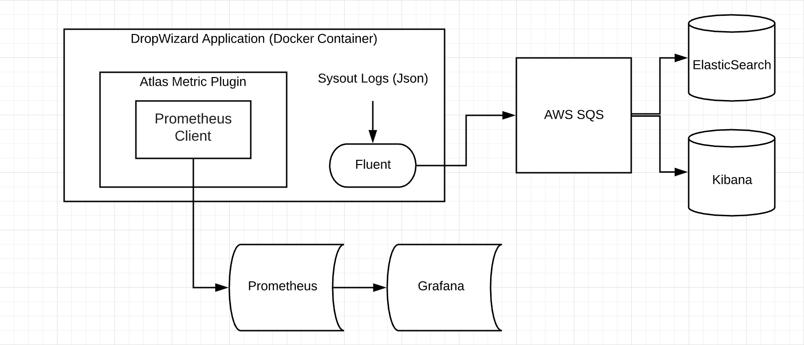

# Metrics and Logging

## High Level
As of the time of this document, SailPoint is largely a java shop, more so then that, a Spring shop. There are quite a few tools that make logging and metric capture easy, that also play nice with Spring. We use a subset of those tool, they are as follows.

* kibana
* grafana
* elasticsearch
* prometheus

As a little context, we generally use prometheus (commonly shortened to prom) and grafana for metrics. We generally use grafana and elasticsearch paired with application logs to capture logs. A high level diagram looks something like this.



## Metrics: Reporting from the application
If you have ever used Spring or Prom in the past, this may be a review, however I will assume you have not. The long story short is Prom runs on a server somewhere and on some regular cadence calls into your app for metrics. As such, your application will need to expose an endpoint where those metrics are available. This is where the Prom client comes in. The Prom client will run inside your app and expose a metrics endpoint typically at the url someIp:somePort/metrics.

To reduce duplicate code, and for ease of development, we have extracted the Prom code into its own library. This lib, which can be included in your Spring project simplifies the metric tracking process and exposes the metrics endpoint at a differnt port for you, so you don't have to worry about Springs restControler. As a general rule of thumb, most SailPoint application run of port 7100, the Prom client is typically ran off 7200. That to say, if you are interested in seeing some metrics, they should be exposed at someIp:7200/metrics.

### Getting it to work
At the highest of levels, all you need to do is import the library, create a counter and start the app, but there are a few gotcha's along the way. 

1. Install the library into the app.
   1. Assuming you are building a gradle application all you have to do is add the following code to your build.gradle file. 
       ```bash
              dependencies 
              {
                    implementation("com.sailpoint:atlas-boot-metrics")
              }
        ``` 
2. Once gradle catches up you can now use the lib. As an example, here we create a metric
   1. As a little context, this method will create a counter metric with two tags, tenantId and serviceId, and then store it in the Prom client. When this metric is called again, the counter will be incremented. It should be noted here that MetricsUtil.getCounter will create the metric should it not already exist. 
        ```java
        	public void logUpdateTenantUsage(UpdateTenantUsageCommand cmd){
        		Map<String, String> tags = new HashMap<String, String>();
        		tags.put("tenantId", cmd.getTenantId().getValue());
        		tags.put("serviceId", cmd.getServiceId().getValue());
        		Counter updateTenantUsageCounter = MetricsUtil.getCounter("UpdateTenantUsageCommand_Counter", tags);
        		updateTenantUsageCounter.inc(1);
        	}
      ```   
3. This code, you could run locally, but it won't work just yet. Or at least not the way we want it to. This is the gotchya. In order for that endpoint to be exposed, and the application to start, you are going to need 3 env variables set.
    1. The ATLAS_JWT_KEY should be a token, and this is typically set by the dev stack set up. The ALTAS_JET_KEY_PARAM_NAME is just a simple string which should be set in the same way. The SPRING_PROFILES_ACTIVE is where things get tricky. This will be set to production in prod due to some dev ops magic, however if you want the metrics exposed when running locally you need to set it to prometheusMetrics.
        ```bash
       ATLAS_JWT_KEY=
       ATLAS_JWT_KEY_PARAM_NAME=/service/oathkeeper/dev/encryption_string
       SPRING_PROFILES_ACTIVE=prometheusMetrics
        ```       
4. Launch the app, generally via a gradlew cli, and you should be good to go. Your app will make a metric, increment it, and expose the url for you to verify. 
    1. But wait! How does this work in prod you ask? How does grafana know to call my service? This is where the dev ops magic comes in, we have our own service discovery module in Prom that wires into our deployment system. When an application gets deployed, grafana gets notified to start calling your applications :7200/metrics endpoint. From there you can start setting up dashboards. 
       